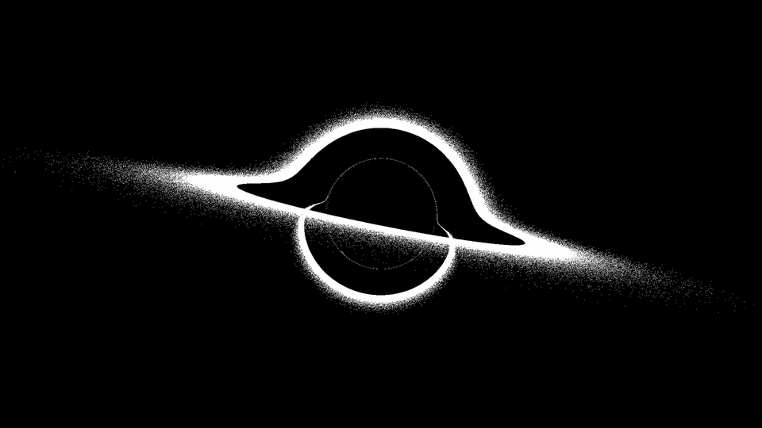

black-hole-raytracer
---

I was curious about how light moves around a black hole, so I decided to build a very simple raytracer. This implementation is single-threaded, runs on CPU, and is very slow.

  

The image above was rendered by the tracer. It's a super-massive black hole with roughly the mass (4e6 SM) of the Sagittarius A* black hole at the center of our galaxy. It's seen at a distance of 8.33 light minutes, with a focal length of 25mm. All lighting is provided by the orbiting accretion disc. A couple interesting things to observe:

  1. The back side of the accretion disc bends around the event horizon, such that we see its "top" above and its bottom "below".
  2. There's a thin line circling just around the event horizon. This is light from the disc that has made one semi-orbit around the black hole and then escaped toward the camera.
  3. There's an even fainter circle just inside the previous circle. I don't know for sure, but I believe this is light that's done a complete orbit around the event horizon and then escaped toward the camera.
